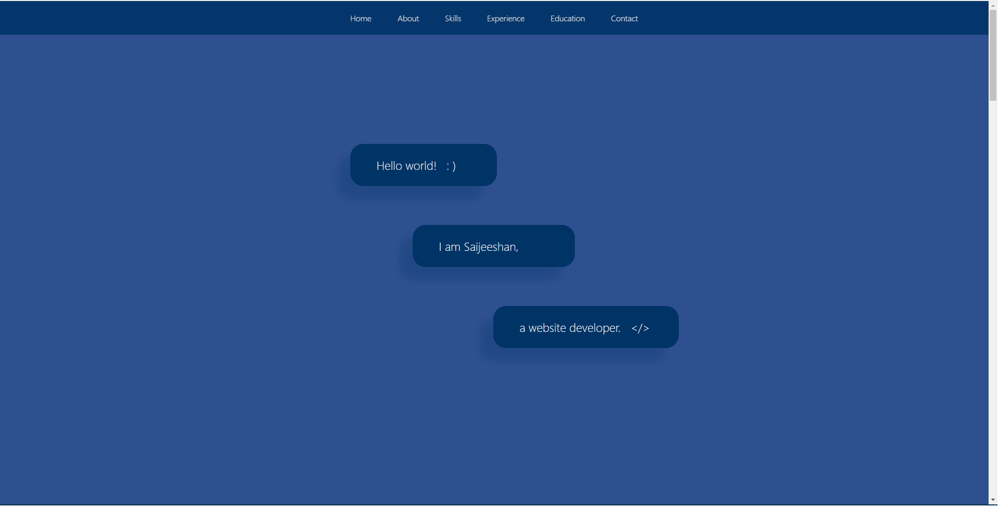

# Personal Portfolio Created with React

In the project directory, you can run:

### `npm start`

Runs the app in the development mode.
Open [http://localhost:3000](http://localhost:3000) to view it in your browser.

Home Page

About Page

Programming Skills Page

Job Experience Page

Education Page

Contact Tab

